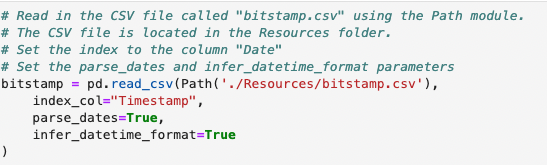
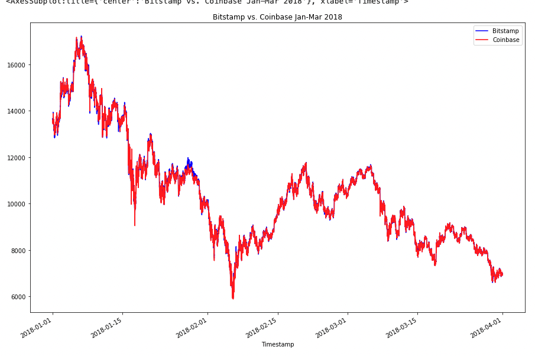
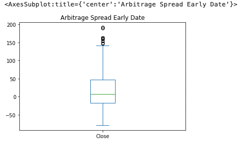
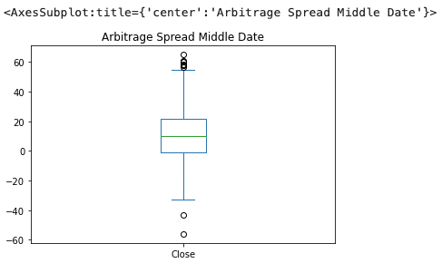
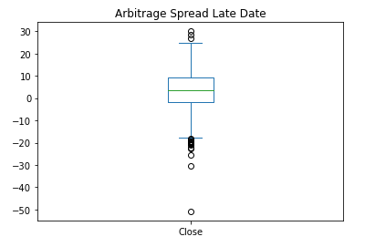
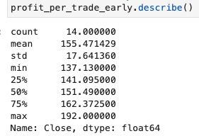
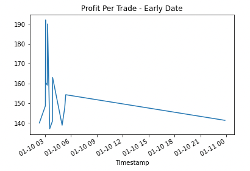
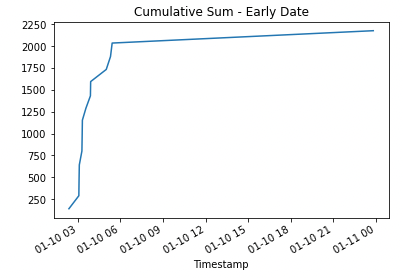

# Arbitrage_opportunities
This project showcases the Crypto Arbitrage opportunities that were happening in early 2018, but within months decreased to nearly nothing. 

Zooming in on past events we can see how volitile markets can sometimes be ripe with arbitrage opportunities. When data collection & buy/sell is automated to watched carefully across multiple exchanges, and act quickly, there are profits to be made!

*This project can be used to calculate the daily profit to be made when arbitrage is high and one acts quickly, vs waiting until many others take advantage of the opportunity causing the markets to normalize as the price difference narrows to zero.*

---

## Technologies

Python implementation: CPython

Python version       : 3.7.13

IPython version      : 7.31.1

Compiler    : Clang 12.0.0 

OS          : Darwin

Release     : 21.6.0

Architecture: 64bit

pandas: 1.3.5

---

## Data Collection and Cleaning

***examples shown below are for one csv file only, and one sliced date dataset, but the code is written to repeat on both csv files and all sliced data sets***

1. **The data for this analysis was pulled using the pathlib library from 2 CSV files, in the Resources folder, containing closing prices on bitstamp and coinbase. Data spans from 01-01-2018 to 03-31-2018.**
    
    
    
    - csv files were converted to a dataframe using Pandas, indexed to the date-time. 

2. **The data was then cleaned and standardized via the following steps**

    - removing null values
    
    `bitstamp = bitstamp.dropna()`
    
    - removing dollar signs in the "Close" column
    
    `bitstamp['Close'] = bitstamp['Close'].str.replace("$", " ")`
    
    - standardized all data types in the "Close" column to float
    
    `bitstamp['Close'] = bitstamp['Close'].astype(float)`
    
    - checked for duplicated values
    
    `bitstamp.duplicated().sum()`

---

## Data Analysis

The data used for analysis was the closing price of the stocks; identified in the "Close" column.
The data was sliced to narrow down the values and time-frame to look closer at areas of interest. 

1. **First, we took a look at the closing data for the enitre time-frame in our data sets.**

    `bitstamp_sliced = bitstamp[['Close']].loc['2018-01-01':'2018-03-31']`

    - General statistics were generated
    
    `bitstamp[["Close"]].describe()`
    
    - The closing price values of the two dataframes over the entire time-frame were plotted for visualization
    

2. **We then focused our analysis on the arbitrage spread between the two exchange values, over 3 different, 1-day periods in the datase**

    - 1-day early in the dataset (early), 1-day midway through the dataset (middle), and 1-day toward the end of the dataset(late).
    
`arbitrage_spread_early = coinbase['Close'].loc['2018-01-10'] - bitstamp['Close'].loc['2018-01-10']`
    
`arbitrage_spread_middle = bitstamp['Close'].loc['2018-02-16'] - coinbase['Close'].loc['2018-02-16']`
    
`arbitrage_spread_late = bitstamp['Close'].loc['2018-03-22'] - coinbase['Close'].loc['2018-03-22']`
    
    - Giving focused data for plotting and a visualization of the spread difference.
    
 

    
3. ** Final Step was determining the profits to be made during each time period identified above.**

    - The arbitrage spread was used for each of the the 3 days selected to find the arbitrage return. Returns were filterd for those with a value over 1%, which accounted for the buy/sell fees. 
    
    `spread_return_early = arbitrage_spread_early[arbitrage_spread_early>0] / bitstamp['Close'].loc['2018-01-10']`
    
    - Profit was determined by multiplying the filtered returns by the cost of the trade value, giving us the profit per trade value.
    
    `profit_early = spread_return_early[spread_return_early > .01] * bitstamp['Close'].loc['2018-01-10']`
    

    - the cumulative sum function `cum_sum` was used and results plotted for each time period to see how profits accumulated over time, showing just how big these opportunities can be, and how fast they can dissapear
    
`cumulative_profit_early = profit_per_trade_early.cumsum()`

## Analysis Conclusion
The analysis shown above is an example of how within very short timeframe, often a few weeks, the arbitrage opportunites in various markets can return a significant profit, but that the opportunity windows are short. The automation of these calculations, can give invaluable insights into when to act quickly.

## Contributors

This project was in conjunction with UC Berkeley staff and myself Jodi Artman.  *artman.jodi@gmail.com*

---

## License

licensed in accordance with UC Berkeley policy

